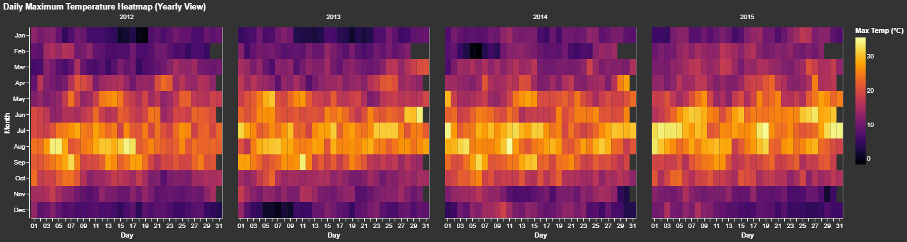
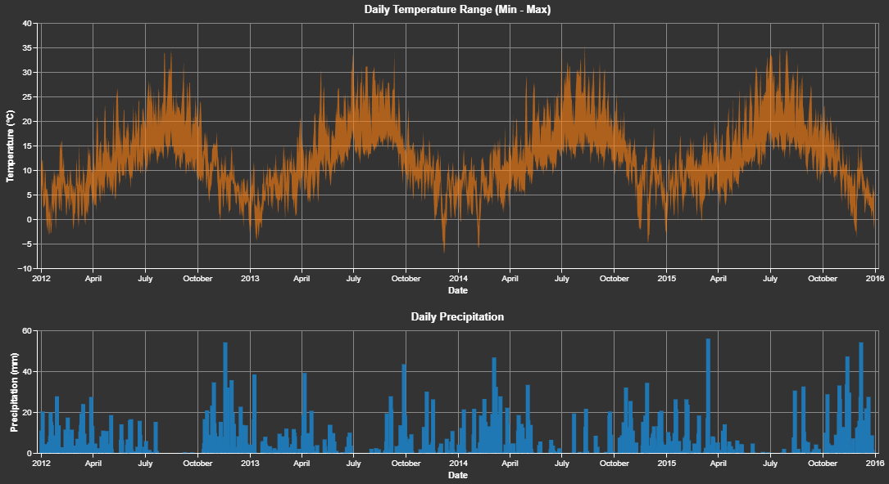
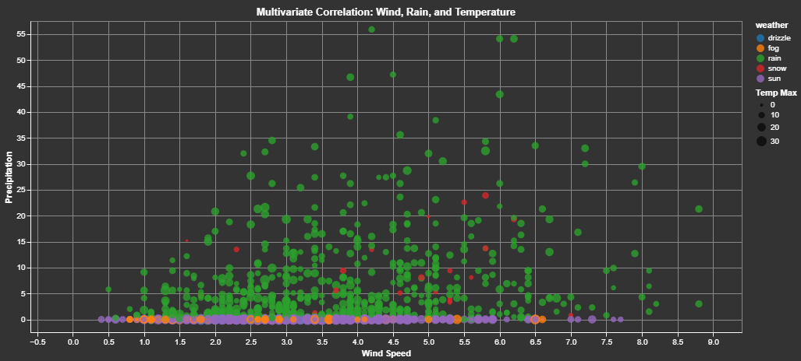

# 🌦️ Seattle Weather: Exploratory Data Analysis


An interactive data science project exploring historical weather patterns in Seattle using **Marimo** (next-gen reactive notebooks) and **Altair** (declarative visualization).

## 📊 Key Visualizations

### 1. Seasonal Temperature Heatmap

Visualizing daily maximum temperatures across multiple years to identify precise seasonal transitions and yearly anomalies.

{width=600}

### 2. Interactive Time Series: Temperature & Precipitation

A linked dashboard allowing users to select specific time intervals to analyze the relationship between temperature ranges and rainfall.

{width=600}

### 3. Multivariate Weather Dynamics

Analyzing the correlation between Wind Speed, Precipitation, and Temperature, categorized by weather conditions.

{width=600}

## 🚀 Key Insights

* **Seasonal Precision**: July and August are consistently the hottest months, while December and January define the cold season.
* **"Wet Winter" Phenomenon**: Heavy rainfall (>20mm) is almost exclusive to Q1 and Q4, confirming Seattle's reputation.
* **Storm Profile**: High-intensity rain events (categorized as "Rain") are strongly correlated with moderate-to-high wind speeds (3.0+).
* **Condition Clusters**: "Snow" and "Drizzle" are typically associated with low precipitation levels (<10mm), unlike heavy "Rain" events.

## 🛠️ Project Structure
```
├── assets/             # Project screenshots/images
├── data/               # Local data storage (ignored by git)
├── notebooks/          # Marimo notebook files (.py)
│   └── 01_eda_weather.py
├── .gitignore          # Git configuration
├── pyproject.toml      # Project dependencies (uv)
└── README.md           # Documentation
```

## 💻 How to Run

This project uses **uv** for ultra-fast dependency management.

1. Clone the repository
```
git clone [https://github.com/](https://github.com/)[INSERT GITHUB USERNAME]/weather-data-eda.git
cd weather-data-eda
```
2. Install Dependencies
```
uv sync
```
3. Run the Interactive Notebook
To view and edit the analysis:
```
uv run marimo edit notebooks/01_eda_weather.py
```

To view as a read-only web app:
```
uv run marimo run notebooks/01_eda_weather.py
```

## 📚 Tech Stack

* Core: `Python`
* Environment: `uv` (Package Manager)
* Analysis: `Pandas`, `NumPy`
* Visualization: `Altair`
* Notebook: `Marimo`